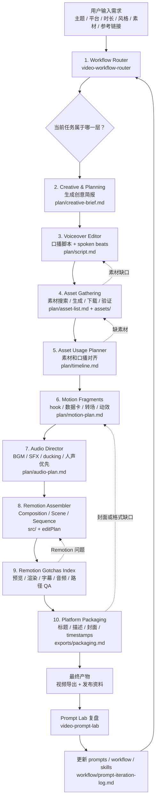
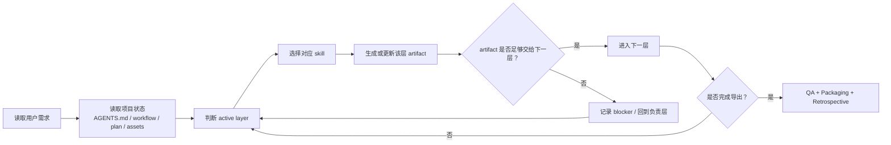

# Agent 工作流程图

这份文档面向第一次看到本项目的人，解释这个“自动剪视频 Agent”到底如何运行。

本项目不是把所有事情塞进一个 prompt，而是让 Codex 像一个视频制作团队一样工作：先判断阶段，再调用对应 skill，产出清晰文件，然后把结果交给下一层。

## 总览流程图



## Agent 决策循环



## 每一层在做什么

### 1. Workflow Router

入口层。它不直接剪视频，也不直接写组件，而是先判断：

- 用户现在是在提创作需求，还是在改脚本？
- 当前缺的是素材、时间线、音乐，还是 Remotion 代码？
- 应该调用哪个 skill？
- 下一步应该产出哪个文件？

对应 skill：

```text
video-workflow-router
```

典型输出：

```text
Active layer: Asset Usage & Alignment
Using skill: asset-usage-planner
Next artifact: plan/timeline.md
```

### 2. Creative & Planning

这一层负责把模糊想法变成可制作的视频方向。

它会明确：

- 视频主题
- 目标平台
- 受众
- 时长
- hook
- 章节结构
- 视觉方向
- 哪些事实需要验证

典型输出：

```text
plan/creative-brief.md
```

### 3. Voiceover Editor

这一层负责把创意写成能说出口的脚本，而不是写成文章。

它会处理：

- 口语化改写
- spoken beats 拆分
- 每个 beat 的时长估算
- A-roll / B-roll 需求
- 每句话需要什么画面支持

对应 skill：

```text
voiceover-editor
```

典型输出：

```text
plan/script.md
```

### 4. Asset Gathering

这一层负责素材池，不负责最终怎么剪。

它会处理：

- 自动列出需要哪些视频、图片、截图、音乐、音效
- 搜索或生成素材
- 下载或转码素材
- 验证素材是否能用
- 记录素材来源、版权状态、用途和文件名

对应 skill：

```text
asset-gathering
```

典型输出：

```text
plan/asset-list.md
assets/
```

### 5. Asset Usage Planner

这一层负责“怎么把素材拼起来”。

它不会下载新素材，而是把已有素材分配到时间线上：

- 哪个 beat 用哪个素材
- 哪段是 A-roll
- 哪段是 B-roll
- 哪里用截图
- 哪里用数据卡
- 哪里需要字幕或文字卡
- 哪些素材重复了
- 哪些 beat 还缺素材

对应 skill：

```text
asset-usage-planner
```

典型输出：

```text
plan/timeline.md
```

### 6. Motion Fragments

这一层负责高级视觉片段。

它会设计：

- 开头 hook frame
- 重点数据卡
- 转场
- kinetic captions
- 网站 demo 放大聚焦
- meme-style 背景
- 封面或标题帧

对应 skill：

```text
motion-fragments
```

典型输出：

```text
plan/motion-plan.md
```

### 7. Audio Director

这一层负责音频策略。

它会规划：

- BGM 风格
- 音乐节奏
- 音效出现时机
- 人声优先级
- ducking
- loop point
- fade in / fade out

对应 skill：

```text
audio-director
```

典型输出：

```text
plan/audio-plan.md
```

### 8. Remotion Assembler

这一层才真正进入代码装配。

它会把前面所有计划转成 Remotion 项目结构：

- `Composition`：视频入口、尺寸、FPS、总时长
- `Scene`：一个语义段落
- `Sequence`：把 scene、字幕、素材、音频放到对应时间点
- `editPlan`：结构化时间线数据
- `CaptionLayer`：字幕层
- `AudioLayer`：音乐和音效层

对应 skill：

```text
remotion-assembler
remotion-best-practices
```

典型输出：

```text
src/
src/data/editPlan.ts
src/layers/CaptionLayer.tsx
src/layers/AudioLayer.tsx
```

### 9. Remotion Gotchas Index

这一层负责调试，不负责重新设计整条视频。

它会检查：

- 预览是否空白
- composition 是否注册
- 素材路径是否正确
- 字幕是否错位
- 音频是否同步
- frame math 是否正确
- render 是否报错

对应 skill：

```text
remotion-gotchas-index
```

### 10. Platform Packaging

这一层负责发布包装。

它会准备：

- 标题
- 描述
- timestamps
- hashtags
- 封面建议
- 导出设置
- QA notes

对应 skill：

```text
platform-packaging
```

典型输出：

```text
exports/packaging.md
```

## 为什么要这样拆

如果让一个 prompt 同时负责脚本、素材、音乐、剪辑、动效、代码和导出，问题会很快变得不可控：

- 素材来源容易丢
- 音乐和 SFX 决策容易混乱
- 时间线容易和脚本错位
- Remotion 代码容易硬编码
- 出错时不知道该改哪一层

本项目的做法是让每一层只做自己的事：

```text
Router 决定方向
Voiceover 只管口播
Asset Gathering 只管素材池
Asset Usage 只管素材怎么用
Motion 只管高级动效
Audio 只管声音策略
Remotion 只管实现
QA 只管验证和修错
Packaging 只管发布
Prompt Lab 只管复盘和优化
```

这样第一次制作会稍慢，但一旦跑通 Baseline v1，后续每次视频创作都会更稳定、更快。

## 一次完整运行长什么样

新用户可以这样理解：

1. 你先给 Agent 一个明确视频需求。
2. Agent 读取 `AGENTS.md` 和 `workflow/video-creation-system.md`。
3. Router 判断当前应该从规划开始。
4. Agent 生成 `plan/creative-brief.md`。
5. Voiceover skill 生成 `plan/script.md`。
6. Asset skill 生成素材清单，并把素材放到 `assets/`。
7. Usage planner 把素材分配到时间线。
8. Motion skill 设计高级视觉片段。
9. Audio skill 设计音乐和音效。
10. Remotion skill 把所有计划装配成代码。
11. Gotchas skill 修预览和渲染问题。
12. Packaging skill 准备发布资料。
13. Prompt Lab 复盘本次制作，更新 prompts 或 skills。

最终，项目会逐步形成自己的稳定生产线。
