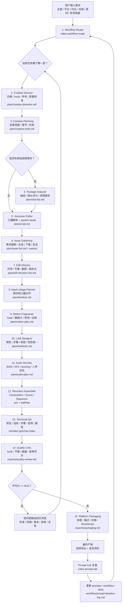
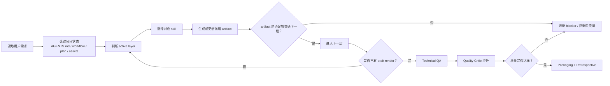

# Agent 工作流程图

这份文档面向第一次看到本项目的人，解释这个“自动剪视频 Agent”如何从“能跑流程”升级到“能追求质量”。

本项目不是把所有事情塞进一个 prompt，而是让 Codex 像一个视频制作团队一样工作：导演定风格，素材分析师看素材，剪辑师做取舍，美术统一视觉，质检官打分，再由实现层装配导出。

## 总览流程图



## Agent 决策循环



## 新增质量层

### Creative Director

负责把“高级一点”翻译成可以执行的标准。

产物：

```text
plan/creative-direction.md
```

它会定义：

- 视频应该像什么参考风格
- 前 3 秒怎么抓人
- 哪些视觉规则不能破
- 节奏是快切、稳重、电影感，还是信息流
- 什么样才算达到质量线

### Footage Analyzer

只要用户给原始视频，就先分析素材，不急着剪。

产物：

```text
plan/shot-list.md
plan/footage-notes.md
```

它会判断：

- 哪些镜头好
- 哪些镜头废
- 哪些地方有文字/logo/瑕疵
- 哪些片段适合开场
- 哪些镜头应该快切或保留

### Edit Director

负责真正的剪辑判断。

产物：

```text
plan/edit-decision-list.md
```

它会决定：

- 开头用哪个镜头
- 哪里快切
- 哪里停留
- 哪些素材不用
- 哪里做 J-cut / L-cut
- 哪些节点需要音效或字幕强调

### Look Designer

负责让视频看起来统一、有质感。

产物：

```text
plan/lookbook.md
plan/title-style.md
```

它会定义：

- 色彩和调色方向
- 字幕样式
- 字体大小
- 标题卡
- 画面边距
- 封面视觉

### Quality Critic

负责判断“好不好”，不是只判断“坏没坏”。

产物：

```text
exports/quality-review.md
```

它会给这些维度打分：

- Hook strength
- Message clarity
- Footage selection
- Edit rhythm
- Visual polish
- Caption readability
- Audio quality
- Motion design
- Platform fit
- Memorability

如果平均分低于 8/10，就不能当最终版，必须回到对应层修改。

## 为什么新版更适合高质量视频

旧流程解决的是“能不能自动跑通”。新版流程解决的是“为什么看起来不高级”。

```text
旧流程：规划 -> 素材 -> 时间线 -> 动效 -> 装配 -> 导出

新版流程：
导演定风格
素材分析师看素材
剪辑师做取舍
美术统一视觉
音频设计节奏
技术层装配
质检官打分返工
```

这意味着 Agent 不再只是把素材拼起来，而是会先判断：

- 这个视频应该像什么
- 哪些素材值得用
- 哪些镜头应该删
- 哪些地方看起来廉价
- 哪些问题需要返工

最终目标不是一次生成完美视频，而是让每一轮都能明确知道“差在哪里、回哪一层改”。
